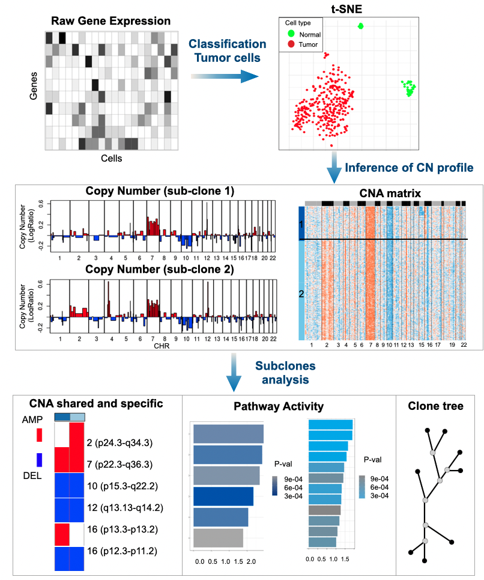

# Single   CEll   Variational   Aneuploidy aNalysis 
<div>


</div>

Article: [A variational algorithm to detect the clonal copy number substructure of tumors from scRNA-seq data
](https://www.nature.com/articles/s41467-023-36790-9)


## Introduction

SCEVAN is an R package that starting from the raw count matrix of scRNA data automatically classifies the cells present in the biopsy by segregating non-malignant cells of tumor microenviroment from the malignant cells and also characterizes the clonal structure of these malignant cells. It identfies cell subpopulations with different copy number architecture and reports g the specific and shared alterations of each subpopulation. The aim of the tool is to automate the entire analysis by allowing it to be performed in a very simple and completely unsupervised way. Analyses carried out on 106 samples and 93332 cells show better classification with an F1 score for all samples of 0.90 compared to 0.63 obtained with the state-of-the-art tools. It also explits a greedy multichannel segmentation algorithms making it particularly fast even for large datasets. 

## Installation

```
library(devtools)
install_github("miccec/yaGST")
install_github("AntonioDeFalco/SCEVAN")
library(SCEVAN)
```

## Usage

### Single-sample analysis
A single call (pipelineCNA) allows the execution of the entire analysis of classification and characterization of clonal structure.

- ***count_mtx*** : Count matrix with genes on rows (both Gene Symbol or Ensembl ID are allowed) and cells on columns.
- ***sample*** : Sample name to save results (optional)
- ***par_cores*** : Number of cores to run the pipeline  (optional - default 20)
- ***norm_cells*** : Vector of possible known normal cells to be used as confident normal cells (optional)
- ***FIXED_NORMAL_CELLS*** : TRUE if norm_cell vector to be used as fixed reference, if you are only interested in clonal structure and not normal/tumor classification (default FALSE)
- ***SUBCLONES*** : Boolean value TRUE if you are interested in analysing the clonal structure and FALSE if you are only interested in the classification of malignant and non-malignant cells (optional - default TRUE)
- ***beta_vega*** : Specifies beta parameter for segmentation, higher beta for more coarse-grained segmentation. (optional - default 0.5)
- ***ClonalCN*** :  Get clonal CN profile inference from all tumour cells (optional)
- ***plotTree*** : Plot Phylogenetic tree (optional - default FALSE) 
- ***AdditionalGeneSets*** : list of additional signatures of normal cell types (optional)
- ***SCEVANsignatures*** : FALSE if you only want to use only the signatures specified in AdditionalGeneSets(optional - default TRUE) 
- ***organism*** : Organism to be analysed (optional - "mouse" or "human" - default "human")

```
results <- pipelineCNA(count_mtx)
```

### Multi-sample analysis
A single call (multiSampleComparisonClonalCN) allows the comparison of clonal profiles of multiple samples.

- ***listCountMtx*** : Named list of raw count matrix of samples to be analysed
- ***listNormCells*** : List of normal cells of each samples to be analysed
- ***analysisName*** : Name of the analysis (optional)
- ***organism*** : Organism to be analysed (optional - "mouse" or "human" - default "human")
- ***par_cores*** : Number of cores (default 20)

```
multiSampleComparisonClonalCN(listCountMtx)
```

### Integration with Seurat
Integration of information obtained with SCEVAN (aneuploidy/diploid, subclones) into Seurat object.

- ***count_mtx*** : Count matrix of sample.

```
results <- pipelineCNA(count_mtx)

#Create Seurat Object with SCEVAN info
seurObj <- Seurat::CreateSeuratObject(count_mtx, meta.data = results)

#or add SCEVAN info to an existing Seurat object
seurObj <-Seurat::AddMetaData(seurObj, metadata = results)
```
If you want to plot CN information at the single-cell level, you can obtain the region of the alteration of interest from the *.seg file and plot the inferred CN ratio from CNA matrix, for example, like this:

```
load("output/MGH106_count_mtx_annot.RData")
load("output/MGH106_CNAmtx.RData")

chr3 <- apply(CNA_mtx_relat[count_mtx_annot$seqnames==3 & count_mtx_annot$start>=158644278 & count_mtx_annot$end<=194498364,], 2, mean)
chr3 <- chr3[rownames(seur_obj@meta.data)]
names(chr3) <- rownames(seur_obj@meta.data)
chr3 <- as.data.frame(chr3)

seur_obj <- AddMetaData(seur_obj, metadata = chr3)
Seurat::FeaturePlot(seur_obj, "chr3", cols = c("gray", "red"))
```


## Plot CNA heatmap with cell annotation (example)

The plotCNA_withAnnotCells function generates a heatmap of the copy number profile for each cell, incorporating cell annotations as tracks. The metadata parameter is a data.frame, where row names represent cell names and columns contain annotations. Additionally, setting SUBCLONE = TRUE enables plotting the copy number profile specifically inferred for subclones.

```
plotCNA_withAnnotCells(SampleName = "MGH106", metadata = pDataMGH, COLUMNS_TO_PLOT = c("cell.assignment", "GBM.type", "patient"))"
```


## Usage examples (vignettes)

- [Intratumoral heterogeneity](http://htmlpreview.github.io/?https://github.com/AntonioDeFalco/SCEVAN/blob/main/vignettes/IntratumoralHeterogeneityInGlioblastoma.html)
- [Multi-sample analysis (2 samples)](http://htmlpreview.github.io/?https://github.com/AntonioDeFalco/SCEVAN/blob/main/vignettes/multiSamplesHeadNeck.html)
- [Multi-sample analysis (3 samples)](http://htmlpreview.github.io/?https://github.com/AntonioDeFalco/SCEVAN/blob/main/vignettes/multiSamples.html)

## Docker
We provide a ready-to-run Docker container that includes SCEVAN R package and dependencies. 

```
docker pull anthonyphis/r_scevan
```

Example of usage:

```
docker run -v /Users/antonio/SCEVAN_vignette1:/home/SCEVAN_vignette1 -it anthonyphis/r_scevan:latest Rscript /home/SCEVAN_vignette1/script_vignette1.R
```

## Sample Datasets

We provide some pre-processed samples used in the examples (vignettes):

- ***MGH106.RData*** and ***listCountMtx.RData***: scRNA data of MGH102, MGH104, MGH105 and MGH106 samples from the public dataset of Gliobastoma (GSE131928), you can download the pre-processed data from [here](https://www.dropbox.com/s/b9udpvhnc2ez9pc/MGH106_data.RData?dl=0) and [here](https://www.dropbox.com/s/esqvnltucdqajg1/listCountMtx.RData?dl=0)  

- ***HNSCC26.RData*** : scRNA data of HNSCC26 Primary and HNSCC26 Lymph Node sample from the public dataset of Head&Neck cancer (GSE10332), you can download the pre-processed data from [here](https://www.dropbox.com/s/6zns12amobs39g8/HNSCC26_data.RData?dl=0)

## Citation

> 
>@article {De Falco2023,\
>&nbsp;&nbsp;&nbsp;&nbsp;&nbsp;&nbsp;	author = {De Falco, Antonio and Caruso, Francesca and Su, Xiao-Dong and Varone, Antonio and Ceccarelli, Michele},\
>&nbsp;&nbsp;&nbsp;&nbsp;&nbsp;&nbsp;	title = {A variational algorithm to detect the clonal copy number substructure of tumors from scRNA-seq data},\
>&nbsp;&nbsp;&nbsp;&nbsp;&nbsp;&nbsp;	year = {2023} \
>&nbsp;&nbsp;&nbsp;&nbsp;&nbsp;&nbsp;	month = {02}, \
>&nbsp;&nbsp;&nbsp;&nbsp;&nbsp;&nbsp;	pages = {1074},\
>&nbsp;&nbsp;&nbsp;&nbsp;&nbsp;&nbsp; volume = {14}, \
>&nbsp;&nbsp;&nbsp;&nbsp;&nbsp;&nbsp;	doi = {10.1038/s41467-023-36790-9},\
&nbsp;&nbsp;&nbsp;&nbsp;&nbsp;&nbsp;	URL = { https://www.nature.com/articles/s41467-023-36790-9 },  
&nbsp;&nbsp;&nbsp;&nbsp;&nbsp;&nbsp;	eprint = { https://www.nature.com/articles/s41467-023-36790-9.pdf }, \
>&nbsp;&nbsp;&nbsp;&nbsp;&nbsp;&nbsp;	journal = {Nature Communications}\
>}
