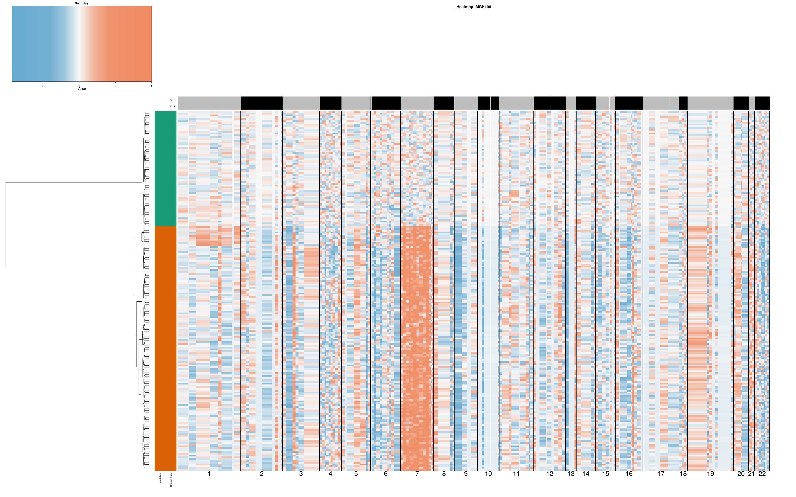
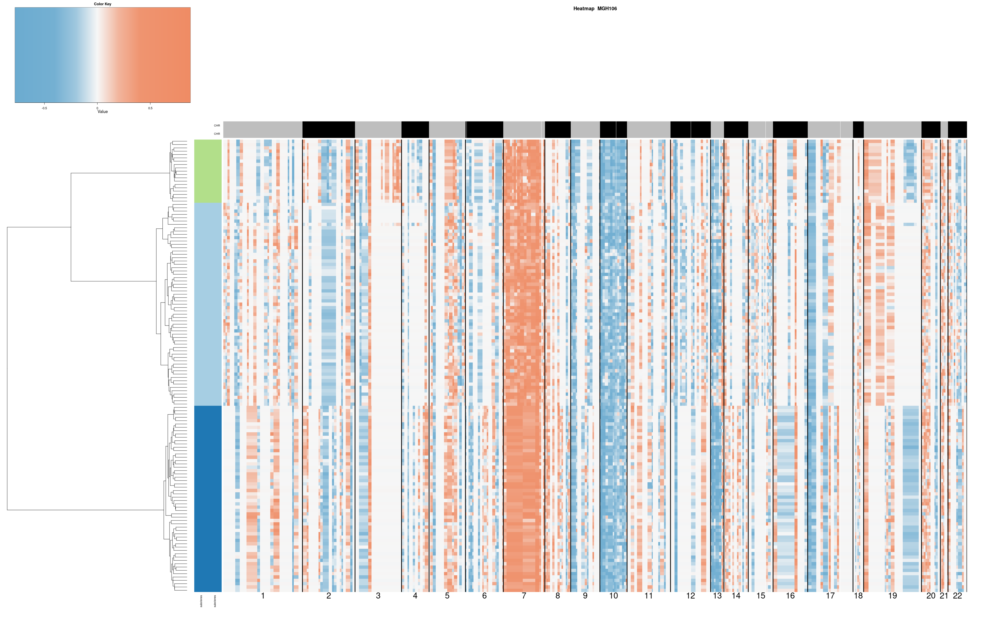
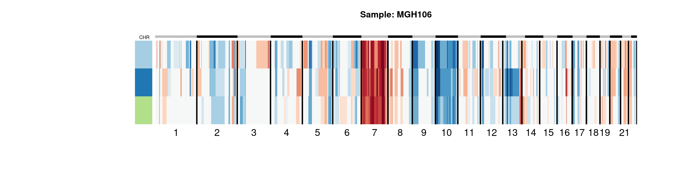
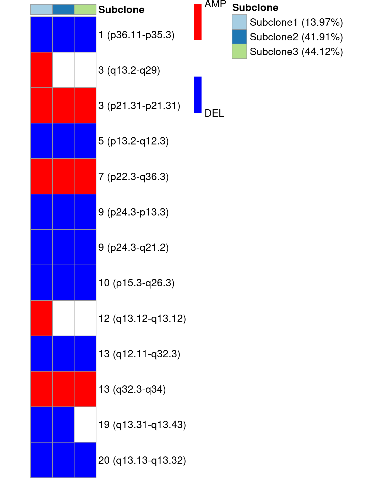
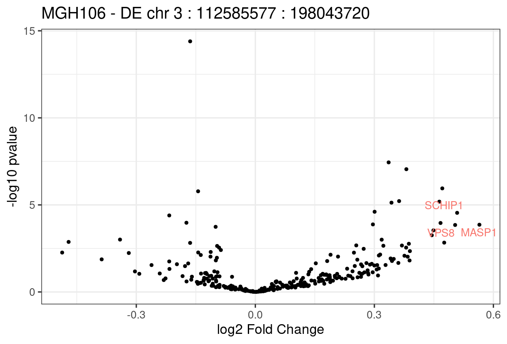
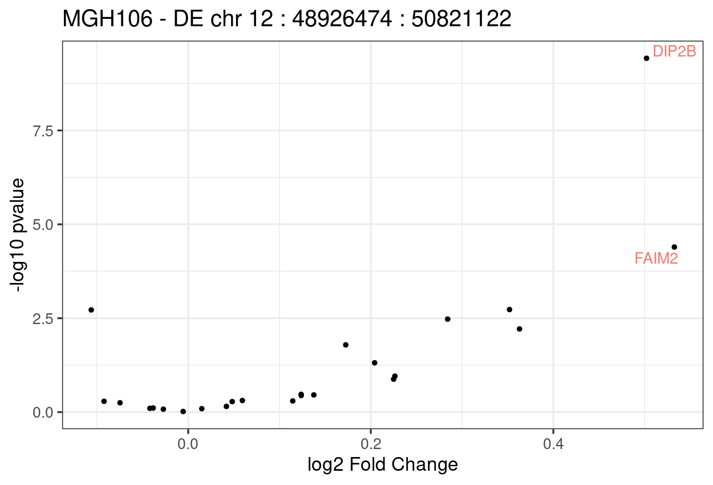
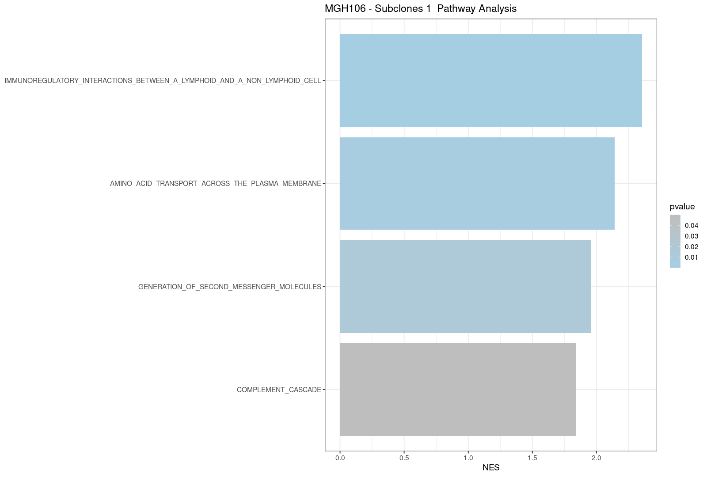
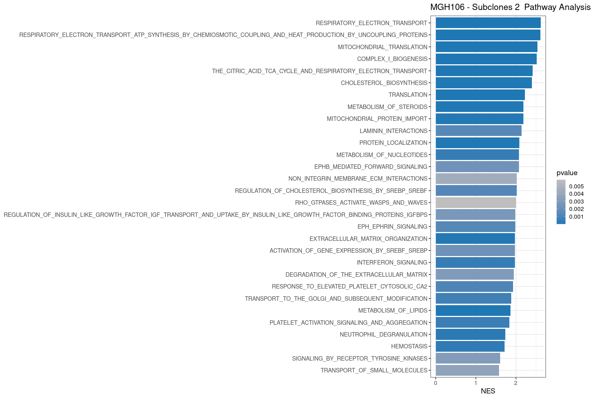
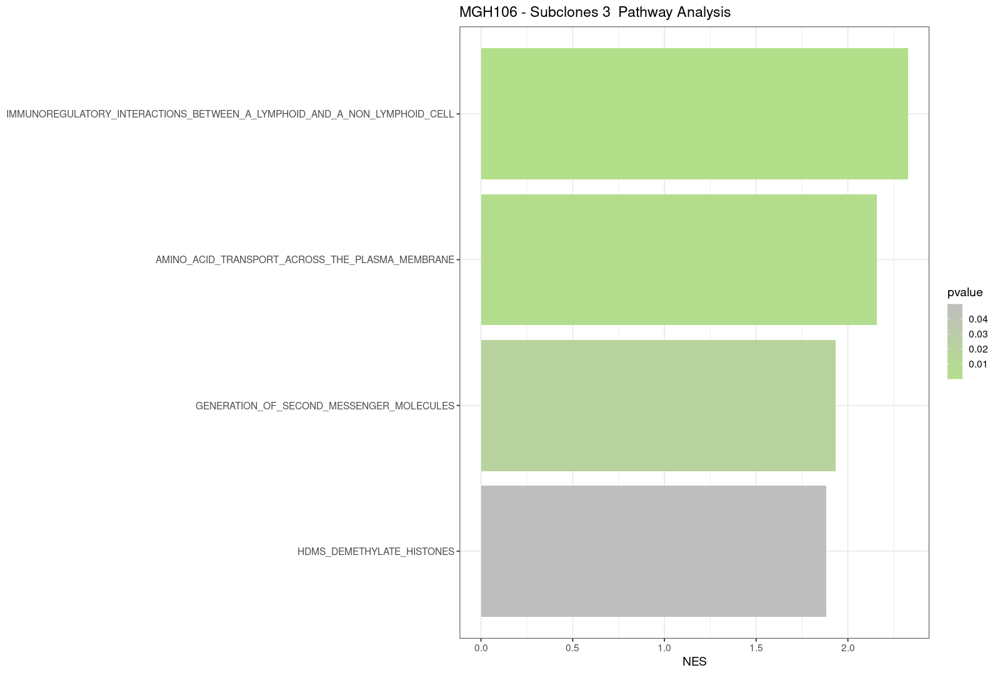

```{r setup, include=FALSE}
knitr::opts_chunk$set(echo = TRUE)
```

```{r echo=TRUE, message=FALSE, warning=FALSE}

library(SCEVAN)

load(url("https://github.com/AntonioDeFalco/SCEVAN/raw/main/data/MGH106_data.RData"))

results <- SCEVAN::pipelineCNA(count_mtx, sample = "MGH106", par_cores = 20, SUBCLONES = TRUE)

```

### Heatmap classification of tumor cells

Heatmap of the Copy Number Alteration matrix with classification of non-malignant and malignant cells.



### Heatmap of tumour cell subclones

Heatmap of the Copy Number Alteration matrix with the clonal subpopulations found.



### Consensus plot

Compact plot of the alterations present in each subpopulation.



### OncoPrint-like plot

OncoPrint-like plot that highlighting specific alteration, shared alteration between subclones, or clonal alteration.



### DE analysis in specific alterations

Vulcano plot obtained from differential expression analysis of the genes belonging to the specific alterations found.





# Pathway Analysis of subclones

REACTOME pathways activity obtained with GSEA for each subclone in contrast to the others for each subclone.





# Results

The pipeline returns in results a data frame containing for each cell its classification and which clonal subpopulation it belongs

```{r echo=TRUE, message=FALSE, warning=FALSE}
results
```